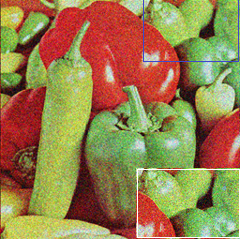
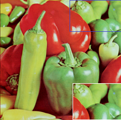

# **Self-Supervised Image Denoising with Attention Mechanism**

## **Project Overview**
This project implements a **self-supervised image denoising model** using deep learning techniques.

### **Key Features**
- **Attention Mechanisms**: Uses **CBAM (Channel & Spatial Attention)** for enhanced feature extraction.
- **Partial Convolutions**: Efficiently processes images with missing or noisy regions.
- **Self-Supervised Learning**: No need for clean ground-truth images.
- **Denoising Accuracy**: Enhances image quality by focusing on relevant regions.
## **Results**

### **Noisy vs. Denoised Images**
<p align="center">
  
  
</p>
<p align="center">
  <b>Noisy Image</b> &nbsp;&nbsp;&nbsp;&nbsp;&nbsp;&nbsp;&nbsp;&nbsp;&nbsp;&nbsp;&nbsp;&nbsp;&nbsp;&nbsp;&nbsp;&nbsp;&nbsp;&nbsp;&nbsp;&nbsp;&nbsp;&nbsp;&nbsp;&nbsp;&nbsp;&nbsp;&nbsp;&nbsp;&nbsp;&nbsp;&nbsp;&nbsp;&nbsp;&nbsp;&nbsp;&nbsp;&nbsp;&nbsp;
  <b>Denoised Image</b>
</p>

## **Installation**
pip install -r requirements.txt
## **How to Run**
---

### **Run the Model**
Execute the script to process and denoise images:
```sh
deepself2self.py


